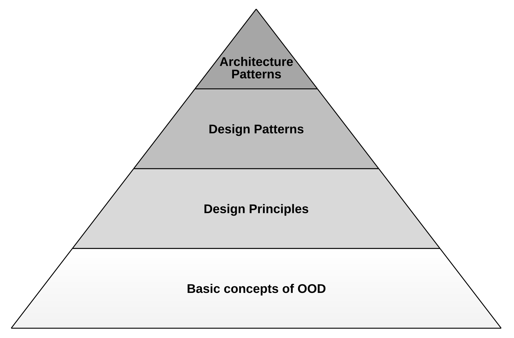
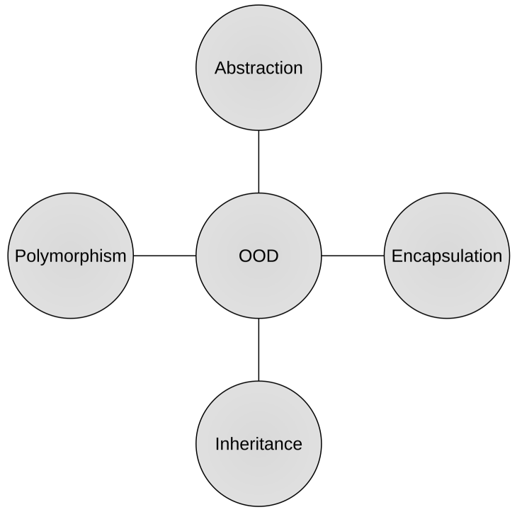
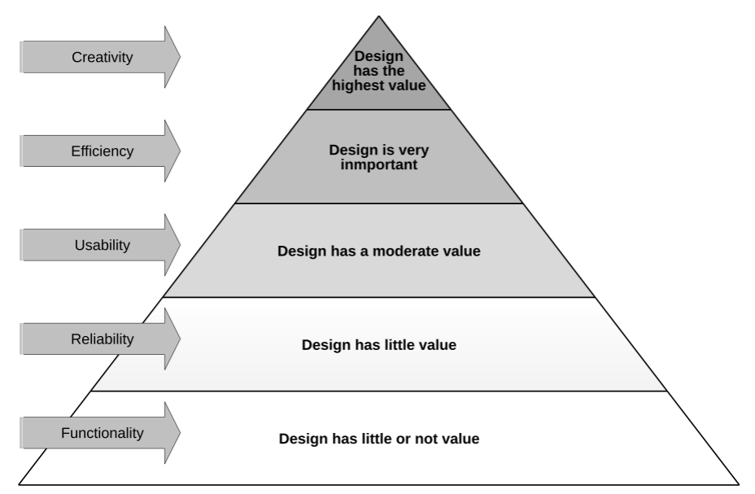

# 2 Basics of Software Design

## 📋 Table of Contents
- [2 Basics of Software Design](#2-basics-of-software-design)
  - [📋 Table of Contents](#-table-of-contents)
  - [📐 2.1 Software Design Pyramid](#-21-software-design-pyramid)
    - [🔷 1. Basic Concepts of Object-Oriented Design (OOD)](#-1-basic-concepts-of-object-oriented-design-ood)
      - [Key Concepts:](#key-concepts)
    - [💡 2. Design Principles](#-2-design-principles)
      - [Common Principles (SOLID):](#common-principles-solid)
    - [🎯 3. Design Patterns](#-3-design-patterns)
      - [Examples:](#examples)
    - [🏛️ 4. Architecture Patterns](#️-4-architecture-patterns)
      - [Examples:](#examples-1)
    - [🧠 Summary Table](#-summary-table)
    - [❓ Interview Questions](#-interview-questions)
- [2.2 Basic Concepts of OOD (Object-Oriented Design)](#22-basic-concepts-of-ood-object-oriented-design)
  - [Class and Object](#class-and-object)
    - [Definition](#definition)
    - [Purpose](#purpose)
    - [Example in Java:](#example-in-java)
  - [🔑 Key OOD Concepts](#-key-ood-concepts)
    - [1. **Abstraction**](#1-abstraction)
      - [Abstract Class vs Interface in Java](#abstract-class-vs-interface-in-java)
      - [Best practices for abstract classes in Java:](#best-practices-for-abstract-classes-in-java)
      - [🎯 When to Choose Abstract Classes Over Interfaces](#-when-to-choose-abstract-classes-over-interfaces)
      - [Best practices for interfaces in Java:](#best-practices-for-interfaces-in-java)
      - [🎯 When to Choose Interfaces Over Abstract Classes](#-when-to-choose-interfaces-over-abstract-classes)
    - [2. **Encapsulation**](#2-encapsulation)
    - [3. **Inheritance**](#3-inheritance)
    - [4. **Polymorphism**](#4-polymorphism)
      - [🔸 1. Compile-Time Polymorphism (Method Overloading)](#-1-compile-time-polymorphism-method-overloading)
      - [🔸 2. Runtime Polymorphism (Method Overriding)](#-2-runtime-polymorphism-method-overriding)
      - [🔄 Polymorphism and Interfaces](#-polymorphism-and-interfaces)
      - [🧠 Summary Table](#-summary-table-1)
  - [🎯 Summary Table](#-summary-table-2)
  - [❓ Interview Questions (with sample answers)](#-interview-questions-with-sample-answers)
  - [🎯 2.3 Goals of Software Design](#-23-goals-of-software-design)
    - [🧠 Key Goals of Software Design](#-key-goals-of-software-design)
    - [🏗️ Design Hierarchy of Needs](#️-design-hierarchy-of-needs)
    - [⚠️ Why Design is Often Ignored](#️-why-design-is-often-ignored)
    - [📌 Summary Table](#-summary-table-3)
    - [💬 Author's Analogy](#-authors-analogy)
  - [⚠️ 2.4 Symptoms of Bad Design](#️-24-symptoms-of-bad-design)
    - [🧩 Common Symptoms](#-common-symptoms)
      - [🔗 High Coupling](#-high-coupling)
      - [🧱 Lack of Modularity](#-lack-of-modularity)
      - [❌ Never-Touch-Running-Code Syndrome](#-never-touch-running-code-syndrome)
      - [🔄 Small Change → Big Impact](#-small-change--big-impact)
      - [📋 Reuse via Copy-Paste](#-reuse-via-copy-paste)
      - [♻️ Cyclic Dependencies](#️-cyclic-dependencies)
    - [🛠️ Root Causes of Bad Design](#️-root-causes-of-bad-design)
    - [📌 Summary Table](#-summary-table-4)
    - [🗣️ Author's Insight](#️-authors-insight)
    - [✅ Takeaway](#-takeaway)
  - [✅ 2.5 Criteria for Good Design](#-25-criteria-for-good-design)
    - [🎯 Primary Goals](#-primary-goals)
      - [1. ✅ Correctness](#1--correctness)
      - [2. 📖 Comprehensibility](#2--comprehensibility)
      - [3. ✨ Simplicity](#3--simplicity)
      - [4. 🔄 Flexibility \& Adaptability](#4--flexibility--adaptability)
      - [5. 🧩 Modularity](#5--modularity)
      - [6. ♻️ Reusability](#6-️-reusability)
      - [7. 🔧 Customizability](#7--customizability)
      - [8. 🔗 Dependency Management](#8--dependency-management)
      - [9. 📈 Scalability](#9--scalability)
      - [10. 🛡️ Resilience](#10-️-resilience)
    - [🧠 Fractal Nature of Good Design](#-fractal-nature-of-good-design)
    - [📌 Summary Table](#-summary-table-5)
    - [🗣️ Author’s Advice](#️-authors-advice)
    - [🧪 Takeaway](#-takeaway-1)
  - [🔒 2.6 Information Hiding](#-26-information-hiding)
    - [🧠 Definition](#-definition)
    - [🎯 Purpose](#-purpose)
    - [🔧 Access Modifiers in Java](#-access-modifiers-in-java)
    - [📜 Visibility Rules (Java Language Specification)](#-visibility-rules-java-language-specification)
    - [💡 Java Example](#-java-example)
    - [🏛️ Design Recommendation](#️-design-recommendation)
    - [⚠️ Avoid Overexposure via Interfaces](#️-avoid-overexposure-via-interfaces)
    - [📦 Modularity and Access Levels](#-modularity-and-access-levels)
    - [🧠 Summary](#-summary)
    - [🗣️ Quote from the Author](#️-quote-from-the-author)
  - [🔗 2.7 Cohesion](#-27-cohesion)
    - [🧠 Definition](#-definition-1)
    - [🎯 Why Cohesion Matters](#-why-cohesion-matters)
    - [🔍 Low Cohesion Example](#-low-cohesion-example)
    - [✅ High Cohesion Example](#-high-cohesion-example)
    - [🧩 Degrees of Cohesion](#-degrees-of-cohesion)
    - [📌 Summary Table](#-summary-table-6)
    - [🗣️ Final Insight](#️-final-insight)
  - [🔗 2.8 Coupling](#-28-coupling)
    - [🧠 Definition](#-definition-2)
    - [🎯 Purpose of Reducing Coupling](#-purpose-of-reducing-coupling)
    - [❗ Consequences of High Coupling](#-consequences-of-high-coupling)
    - [🔍 Types of Coupling](#-types-of-coupling)
    - [🧠 Key Design Recommendation](#-key-design-recommendation)
    - [🛠️ Coupling Reduction Strategies](#️-coupling-reduction-strategies)
    - [🔁 Relationship to Cohesion](#-relationship-to-cohesion)
    - [📌 Summary Table](#-summary-table-7)
    - [🗣️ Final Insight](#️-final-insight-1)
  - [🔄 2.9 Cohesion - Coupling](#-29-cohesion---coupling)
    - [🧠 Overview](#-overview)
    - [📐 Definitions](#-definitions)
    - [🎯 Design Guidelines](#-design-guidelines)
    - [⚠️ Important Insight](#️-important-insight)
    - [📌 Summary Table](#-summary-table-8)
    - [🗣️ Final Thought](#️-final-thought)
  - [🧱 2.10 Big Ball of Mud](#-210-big-ball-of-mud)
    - [🧠 Definition](#-definition-3)
    - [❗ Characteristics](#-characteristics)
    - [🔍 Symptoms](#-symptoms)
    - [📉 Common Causes](#-common-causes)
    - [🛑 Risks of a Big Ball of Mud](#-risks-of-a-big-ball-of-mud)
    - [💡 Prevention and Refactoring Tips](#-prevention-and-refactoring-tips)
    - [📌 Summary](#-summary-1)
    - [📚 Reference](#-reference)
    - [🗣️ Final Thought](#️-final-thought-1)
  - [🏛️ 2.11 Architecture Principles](#️-211-architecture-principles)
    - [🧠 1. KISS – *Keep It Simple, Stupid*](#-1-kiss--keep-it-simple-stupid)
    - [🔮 2. YAGNI – *You Aren’t Gonna Need It*](#-2-yagni--you-arent-gonna-need-it)
    - [😲 3. POLA – *Principle of Least Astonishment*](#-3-pola--principle-of-least-astonishment)
    - [🧩 4. SoC – *Separation of Concerns*](#-4-soc--separation-of-concerns)
    - [💥 5. If It Hurts, Do It More Often](#-5-if-it-hurts-do-it-more-often)
    - [🚸 6. Boy Scout Rule – *Leave the Code Better Than You Found It*](#-6-boy-scout-rule--leave-the-code-better-than-you-found-it)
    - [🗣️ 7. Talk to People](#️-7-talk-to-people)
    - [📌 Summary Table](#-summary-table-9)
    - [🗣️ Final Insight](#️-final-insight-2)
  - [🧠 2.12 Cognitive Psychology and Architectural Principles](#-212-cognitive-psychology-and-architectural-principles)
    - [📘 Overview](#-overview-1)
    - [🧬 Human Cognitive Mechanisms](#-human-cognitive-mechanisms)
    - [🏗️ Application in Architecture](#️-application-in-architecture)
    - [📚 Reference to Further Reading](#-reference-to-further-reading)
    - [🎯 Takeaway](#-takeaway-2)
    - [🧠 Summary](#-summary-2)
- [🏗️ 2.13 Layered Architecture](#️-213-layered-architecture)
  - [📚 2.13.1 Use of Layered Architecture](#-2131-use-of-layered-architecture)
    - [🧠 Overview](#-overview-2)
    - [🧱 Key Concepts](#-key-concepts)
    - [🧩 Common Layers in a 3-Tier Architecture](#-common-layers-in-a-3-tier-architecture)
    - [🔁 Layer Interaction Flow](#-layer-interaction-flow)
    - [⚠️ Layer Violation Warning](#️-layer-violation-warning)
    - [🧪 Implementation Advice](#-implementation-advice)
    - [📦 Example: Class Package Structure](#-example-class-package-structure)
      - [By Technical Tier:](#by-technical-tier)
    - [✅ Benefits](#-benefits)
    - [🗣️ Final Thought](#️-final-thought-2)
  - [🚫 2.13.2 Violated Layered Architecture](#-2132-violated-layered-architecture)
    - [🔍 Definition](#-definition-4)
    - [❗ Consequences](#-consequences)
    - [✅ Recommendation](#-recommendation)
  - [📏 2.13.3 Horizontal Layering](#-2133-horizontal-layering)
    - [📦 Structure](#-structure)
    - [⚠️ Drawbacks](#️-drawbacks)
  - [📏 2.13.3 Horizontal Layering](#-2133-horizontal-layering-1)
    - [📦 Structure](#-structure-1)
    - [⚠️ Drawbacks](#️-drawbacks-1)
  - [📁 2.13.4 Feature-Based Layering – Single Package](#-2134-feature-based-layering--single-package)
    - [🧩 Structure](#-structure-2)
    - [✅ Advantages](#-advantages)
  - [📂 2.13.5 Feature-Based Layering – Slices before Layers](#-2135-feature-based-layering--slices-before-layers)
    - [🧩 Structure](#-structure-3)
    - [❗ Trade-Off](#-trade-off)
  - [🛡️ 2.13.6 Feature-Based Layering – Hexagonal Architecture](#️-2136-feature-based-layering--hexagonal-architecture)
    - [💡 Overview](#-overview-3)
    - [🧩 Structure Example](#-structure-example)
    - [✅ Benefits](#-benefits-1)
  - [🧱 2.13.7 The Java Module System](#-2137-the-java-module-system)
    - [📦 Introduced in Java 9](#-introduced-in-java-9)
    - [✅ Benefits](#-benefits-2)
  - [📌 Summary Table](#-summary-table-10)
- [📢 2.14 Screaming Architecture](#-214-screaming-architecture)
  - [🧠 Overview](#-overview-4)
  - [📢 What Should Architecture "Scream"?](#-what-should-architecture-scream)
  - [🧩 How to Achieve Screaming Architecture](#-how-to-achieve-screaming-architecture)
  - [📦 Example: Feature-Oriented Structure](#-example-feature-oriented-structure)
- [🧪 2.15 Testing the Architecture and Design](#-215-testing-the-architecture-and-design)
  - [🧠 Overview](#-overview-5)
  - [🎯 Why Test the Architecture?](#-why-test-the-architecture)
  - [🔧 Tools for Architectural Testing](#-tools-for-architectural-testing)
  - [📌 What to Test](#-what-to-test)
  - [✅ Best Practices](#-best-practices)
  - [🗣️ Final Thought](#️-final-thought-3)
- [⚙️ 2.16 Software Engineering Values](#️-216-software-engineering-values)
  - [🧠 Overview](#-overview-6)
  - [✅ Key Values](#-key-values)
    - [🧪 Testability](#-testability)
    - [🛠️ Maintainability](#️-maintainability)
    - [🧩 Consistency](#-consistency)
    - [🧱 Modularity](#-modularity)
    - [🧼 Simplicity](#-simplicity)
  - [📌 Summary Table](#-summary-table-11)
  


## 📐 2.1 Software Design Pyramid



The Software Design Pyramid is a conceptual model that structures the evolution of software design skills and practices into four progressive layers. Each layer builds upon the foundations established in the one below it, guiding developers toward mastering software craftsmanship.


---

### 🔷 1. Basic Concepts of Object-Oriented Design (OOD)

This is the foundation of the pyramid and includes key ideas that every developer must master to write structured and maintainable code.

#### Key Concepts:
- **Class and Object**: Core units of object-oriented programming.
- **Encapsulation**: Bundling data with methods that operate on that data.
- **Abstraction**: Hiding complexity and showing only essential features.
- **Inheritance**: Mechanism to derive new classes from existing ones.
- **Polymorphism**: Ability to call the same method on different objects and have each respond in its own way.

---

### 💡 2. Design Principles

Design principles help improve the structure and maintainability of codebases. They act as guidelines to write better object-oriented code.

#### Common Principles (SOLID):
- **S** - Single Responsibility Principle
- **O** - Open/Closed Principle
- **L** - Liskov Substitution Principle
- **I** - Interface Segregation Principle
- **D** - Dependency Inversion Principle

These principles promote scalability, flexibility, and testability.

---

### 🎯 3. Design Patterns

Design patterns are general, reusable solutions to commonly occurring problems in software design. They are based on design principles.

#### Examples:
- **Creational**: Singleton, Factory, Builder
- **Structural**: Adapter, Decorator, Composite
- **Behavioral**: Observer, Strategy, Command

---

### 🏛️ 4. Architecture Patterns

Architecture patterns define the overall structure of applications and how different modules communicate.

#### Examples:
- **Layered Architecture**
- **Microservices Architecture**
- **Event-Driven Architecture**
- **Hexagonal Architecture**

These patterns help manage complexity at a system-wide level and support maintainability and scalability.

---

### 🧠 Summary Table

| Layer                     | Focus Area                    | Goal                                 |
| ------------------------- | ----------------------------- | ------------------------------------ |
| **Architecture Patterns** | System-wide structure         | Scalability and maintainability      |
| **Design Patterns**       | Code-level reusable solutions | Reusability and flexibility          |
| **Design Principles**     | Guidelines for code structure | Clean and maintainable object design |
| **Basic concepts of OOD** | Core OOP ideas                | Foundational programming knowledge   |

### ❓ Interview Questions

1. **What are the four layers of the Software Design Pyramid?**  
   > The layers are: Basic Concepts of OOD, Design Principles, Design Patterns, and Architecture Patterns.

2. **Why is object-oriented design fundamental to this pyramid?**  
   > It provides the building blocks (classes, objects, polymorphism) for all higher-level design practices citeturn1view0.

3. **How do SOLID principles contribute to maintainability?**  
   > They enforce single responsibility, open/closed extension, substitutability, interface segregation, and dependency inversion for flexible and robust code citeturn2view0.

4. **Give an example of how a design pattern and an architecture pattern differ.**  
   > A Factory Method (design pattern) creates objects, while Layered Architecture (architecture pattern) separates application concerns across layers citeturn3view0 citeturn0search3.

5. **Why might a team choose Event-Driven Architecture?**  
   > For decoupled communication, scalability, and real-time processing needs citeturn0search8.

---
---


# 2.2 Basic Concepts of OOD (Object-Oriented Design)



This section introduces the four fundamental principles of Object-Oriented Design (OOD), which form the backbone of designing clean and modular software in Java.

---

## Class and Object

### Definition
- A **class** is a blueprint or template for creating objects. It defines properties (fields) and behaviors (methods) that its instances (objects) will have.
- An **object** is an instance of a class, representing a specific entity with actual values stored in memory.

### Purpose
- Classes allow for code reuse, structure, and abstraction by defining types of entities.
- Objects encapsulate data and behavior, enabling modular, maintainable, and testable programs.

### Example in Java:
```java
// Class definition
public class Car {
    String color;
    String model;

    void drive() {
        System.out.println("The car is driving.");
    }
}

// Creating objects from the class
public class Main {
    public static void main(String[] args) {
        Car myCar = new Car();
        myCar.color = "Red";
        myCar.model = "Toyota Corolla";
        myCar.drive(); // Output: The car is driving.
    }
}
```


## 🔑 Key OOD Concepts

### 1. **Abstraction**

**Definition:**  

**Abstraction** is the process of hiding unnecessary internal implementation details and exposing only the essential characteristics and behavior of an object.

It allows you to define **what** an object does, rather than **how** it does it.

In Java, abstraction is achieved in two primary ways:
- **Abstract classes**
- **Interfaces**

**Purpose:**  
- Simplifies complex systems by focusing only on relevant details.
- Promotes loose coupling between components.
- Facilitates code readability and maintenance.
- Enables flexibility and extensibility in design.

Abstraction plays a crucial role in API design, system architecture, and component interaction. It allows developers to use functionality without needing to understand or modify the underlying implementation.

**🏗️ Real-World Analogy**

Think of **a car**:
- **You use it** by pressing pedals, turning the wheel, etc. (**what** it does).
- You **don’t need to know** how the fuel injection system or engine management works (**how** it does it).


**💡 Java Example: Abstract Class**
```java
// Abstract class
// 1. Abstract class definition
// - Serves as a base template for all animals
// - Cannot be instantiated directly (can't do 'new Animal()')
abstract class Animal {
    // 2. Abstract method (no implementation)
    // - Forces all concrete subclasses to provide their own implementation
    // - Defines WHAT animals must do (make sound), not HOW
    abstract void makeSound();
    
    // 3. Concrete method with implementation
    // - Shared behavior for ALL animal subclasses
    // - Subclasses inherit this automatically (can optionally override)
    void sleep() {
        System.out.println("Sleeping...");
    }
}

// 4. Concrete subclass
// - Provides specific implementation of the abstract method
class Dog extends Animal {
    @Override
    void makeSound() {
        // Dog-specific sound implementation
        System.out.println("Woof!");
        // Could add dog-specific logic here
    }
    
    // Note: sleep() is inherited but NOT overridden
    // Dogs use the default animal sleeping behavior
}

public class Main {
    public static void main(String[] args) {
        // 5. Polymorphism in action
        // - Variable declared as Animal type (abstract)
        // - Actually holds a Dog instance (concrete)
        Animal myDog = new Dog();
        
        // 6. Method calls demonstrate:
        // - makeSound() uses Dog's implementation
        myDog.makeSound(); // Output: "Woof!"
        
        // - sleep() uses inherited Animal implementation
        myDog.sleep();     // Output: "Sleeping..."
        
        // 7. Why this matters:
        // - We could create other animals easily:
        //   class Cat extends Animal { ... }
        // - All would share sleep() behavior
        // - Each would implement makeSound() differently
    }
}
```

**💡 Java Example: Interface**
```java
// 1. Define the abstraction (contract)
// The interface declares WHAT payment methods must do, not HOW they do it
interface PaymentMethod {
    // Any class implementing this interface MUST provide this method
    void pay(double amount);
}

// 2. Concrete implementation #1
class CreditCard implements PaymentMethod {
    @Override
    public void pay(double amount) {
        // Actual implementation for credit card payments
        System.out.println("Paid $" + amount + " with Credit Card.");
        // In a real app, this would connect to a payment gateway
    }
}

// 3. Concrete implementation #2 
class PayPal implements PaymentMethod {
    @Override
    public void pay(double amount) {
        // Different implementation for PayPal
        System.out.println("Paid $" + amount + " with PayPal.");
        // Would actually call PayPal's API here
    }
}

public class Checkout {
    public static void main(String[] args) {
        // 4. Polymorphism in action
        // We declare the variable as the INTERFACE type
        PaymentMethod method;
        
        // But instantiate a CONCRETE implementation
        method = new PayPal();  // Could easily swap to CreditCard here
        
        // 5. The magic of abstraction:
        // - Checkout class ONLY knows about the PaymentMethod interface
        // - It doesn't care which concrete implementation is used
        method.pay(50.0); 
        
        // 6. Key benefits:
        // - Easy to add new payment methods (just implement the interface)
        // - No changes needed in Checkout when adding new methods
        // - Loose coupling between components
    }
}
```

#### Abstract Class vs Interface in Java

**Comparison Table** 📊 

| Feature            | Abstract Class                                | Interface                                                                       |
| ------------------ | --------------------------------------------- | ------------------------------------------------------------------------------- |
| **Purpose**        | Partial abstraction, shared implementation    | Complete abstraction, contract                                                  |
| **Methods**        | Can have abstract and non-abstract methods    | Traditionally only abstract methods (default/static methods allowed in Java 8+) |
| **Inheritance**    | Supports single inheritance                   | Supports multiple inheritance                                                   |
| **Variables**      | Can have static, non-static, final, non-final | Only `static final` variables                                                   |
| **Implementation** | Subclass must implement all abstract methods  | Implementing class must provide all method implementations                      |
| **Instantiation**  | Cannot be instantiated directly               | Cannot be instantiated directly                                                 |
| **Constructors**   | Can have constructors                         | Cannot have constructors                                                        |
| **Main method**    | Can have a `main` method                      | Cannot have a `main` method                                                     |

---

**🎯 When to Use**

 **Abstract Classes**
- ✅ When you need to **share common implementation** among subclasses.
- ✅ When you want to **enforce a class hierarchy** (e.g., base class with partial defaults).
- ✅ When you need **constructors** or **non-final variables**.

 **Interfaces**
- ✅ When you need **multiple inheritance** of behavior (Java 8+ supports default methods).
- ✅ When defining a **contract** (e.g., APIs, callbacks).
- ✅ When you want **loose coupling** ("program to interfaces, not implementations").


#### Best practices for abstract classes in Java:

**1. Sharing Common Implementation**
```java
abstract class Animal {
    // Concrete method (shared by all subclasses)
    public void eat() {
        System.out.println("This animal eats food.");
    }

    // Abstract method (must be implemented by subclasses)
    public abstract void makeSound();
}

class Dog extends Animal {
    @Override
    public void makeSound() {
        System.out.println("Woof woof!");
    }
}

public class Main {
    public static void main(String[] args) {
        Dog myDog = new Dog();
        myDog.eat();       // Inherited from Animal (shared implementation)
        myDog.makeSound();  // Dog-specific implementation
    }
}
```

**Key Points:**

- Animal provides reusable **eat**() method.
- Subclasses must implement **makeSound**().


**2. Enforcing Hierarchy with Defaults**

```java
abstract class Shape {
    protected String color;  // Non-final field

    // Abstract class CAN have constructors
    public Shape(String color) {
        this.color = color;
    }

    // Concrete method
    public String getColor() {
        return color;
    }

    // Abstract method (enforces implementation)
    public abstract double area();
}

class Circle extends Shape {
    private double radius;

    public Circle(String color, double radius) {
        super(color);  // Calls parent constructor
        this.radius = radius;
    }

    @Override
    public double area() {
        return Math.PI * radius * radius;
    }
}

public class Main {
    public static void main(String[] args) {
        Circle myCircle = new Circle("Red", 5.0);
        System.out.println("Color: " + myCircle.getColor());  // From Shape
        System.out.println("Area: " + myCircle.area());      // Circle's implementation
    }
}
```

**Key Points:**

- Shape enforces area() calculation for all shapes.
- Constructor initializes shared state (color).


**3. Using Constructors and Non-Final Fields**
```java
abstract class Vehicle {
    protected String model;  // Mutable field (non-final)
    protected int year;

    // Constructor in abstract class
    public Vehicle(String model, int year) {
        this.model = model;
        this.year = year;
    }

    // Concrete method
    public void startEngine() {
        System.out.println(model + "'s engine started.");
    }

    // Abstract method
    public abstract void stopEngine();
}

class Car extends Vehicle {
    public Car(String model, int year) {
        super(model, year);
    }

    @Override
    public void stopEngine() {
        System.out.println(model + "'s engine stopped.");
    }
}

public class Main {
    public static void main(String[] args) {
        Car myCar = new Car("Tesla Model 3", 2023);
        myCar.startEngine();  // Inherited from Vehicle
        myCar.stopEngine();   // Car-specific implementation
    }
}
```

**Key Points:**

- Vehicle manages common fields (model, year).
- Subclasses extend behavior while reusing base logic.

#### 🎯 When to Choose Abstract Classes Over Interfaces


| Scenario                     | Abstract Class | Interface                |
| ---------------------------- | -------------- | ------------------------ |
| Share method implementations | ✅ Yes          | ❌ No (pre-Java 8)        |
| Use constructors             | ✅ Yes          | ❌ No                     |
| Non-final fields             | ✅ Yes          | ❌ No (only static final) |
| Single inheritance           | ✅ Yes          | ❌ No (multiple allowed)  |

💡 Java 8+ Note: Interfaces can now have default methods, but still lack constructors and mutable fields.


#### Best practices for interfaces in Java:

**1: Multiple Inheritance of Behavior**

```java
// Interface defining flying capability
interface Flyable {
    // Java 8+ default method (shared behavior)
    default void takeOff() {
        System.out.println("Default takeoff procedure");
    }
    
    // Traditional abstract method
    void fly();
}

// Interface defining swimming capability
interface Swimmable {
    default void startSwimming() {
        System.out.println("Entering the water");
    }
    
    void swim();
}

// Class can implement MULTIPLE interfaces (Java doesn't allow multiple class inheritance)
class Duck implements Flyable, Swimmable {
    @Override
    public void fly() {
        System.out.println("Duck flying with wings");
    }
    
    @Override
    public void swim() {
        System.out.println("Duck paddling in water");
    }
    
    // Can override default methods if needed
    @Override
    public void takeOff() {
        System.out.println("Duck running on water to take off");
    }
}

public class Main {
    public static void main(String[] args) {
        // 1. Multiple inheritance demonstration
        Duck donald = new Duck();
        donald.takeOff();  // Uses overridden default method
        donald.fly();
        donald.startSwimming();  // Uses default method from Swimmable
        donald.swim();
    }
}
```

**Key Points:**

**✅ Core Advantage:**

- Classes can implement multiple interfaces (unlike single inheritance with abstract classes).

**🛠 Java 8+ Features:**

- default methods enable shared behavior in interfaces (e.g., Flyable.takeOff()).
- Subclasses can override default methods or use them as-is.

**⚠ Limitations:**

- No instance fields (only static final constants).
- No constructors.


**2: Defining Contracts (APIs)**

```java
// Payment processing contract
interface PaymentProcessor {
    // No implementation details - pure contract
    void processPayment(double amount);
    boolean validatePayment();
}

// Concrete implementation for Stripe
class StripeProcessor implements PaymentProcessor {
    @Override
    public void processPayment(double amount) {
        System.out.println("Processing $" + amount + " via Stripe");
        // Actual Stripe API calls would go here
    }
    
    @Override
    public boolean validatePayment() {
        System.out.println("Stripe validation complete");
        return true;
    }
}

public class Main {
    public static void main(String[] args) {
        // 2. Contract/API usage
        PaymentProcessor stripe = new StripeProcessor();
        stripe.processPayment(99.99);

    }
}
```

**Key Points:**

**✅ Core Advantage:**

- Enforces "what" (method signatures) without specifying "how".

**📜 Standard Uses:**

- API design (e.g., PaymentProcessor).
- Callback systems (e.g., EventListener).

**⚡ Critical Note:**

- All interface methods are implicitly public abstract (except default/static).


**Scenario 3: Loose Coupling**

```java
// High-level module depends on abstraction
class OrderService {
    private PaymentProcessor processor;
    
    // Constructor injection (dependency inversion)
    public OrderService(PaymentProcessor processor) {
        this.processor = processor;
    }
    
    public void checkout(double amount) {
        if (processor.validatePayment()) {
            processor.processPayment(amount);
        }
    }
}

public class Main {
    public static void main(String[] args) {
        PaymentProcessor stripe = new StripeProcessor();
        stripe.processPayment(99.99);
        // 3. Loose coupling in action
        OrderService service = new OrderService(stripe);
        service.checkout(49.95);
        // Could easily switch payment providers without changing OrderService:
        // OrderService paypalService = new OrderService(new PayPalProcessor());
    }
}

```

**Key Points:**

**✅ Core Advantage:**

- Depend on abstractions (interfaces), not concrete implementations.

**📌 SOLID Principle:**

- Dependency Inversion (D in SOLID): High-level modules shouldn’t depend on low-level details.

**🔄 Flexibility:**

- Easily swap implementations (e.g., OrderService using StripeProcessor or PayPalProcessor).


#### 🎯 When to Choose Interfaces Over Abstract Classes


| Scenario               | Interface                                    | Abstract Class                            |
| ---------------------- | -------------------------------------------- | ----------------------------------------- |
| Multiple inheritance   | ✅ Yes (unlimited implementations)            | ❌ No (single inheritance only)            |
| API contracts          | ✅ Perfect for pure abstractions              | ⚠️ Less ideal (can contain implementation) |
| Default methods        | ✅ Yes (Java 8+)                              | ❌ N/A (all methods can have bodies)       |
| Loose coupling         | ✅ Ideal ("program to interfaces")            | ⚠️ Tighter coupling to hierarchy           |
| Functional programming | ✅ Single-method interfaces work with lambdas | ❌ Not applicable                          |
| State management       | ❌ No fields (except static final)            | ✅ Can have instance fields                |
| Constructors           | ❌ Never                                      | ✅ Yes                                     |
| Code reuse             | ⚠️ Limited (default methods only)             | ✅ Full shared implementations             |


---
---

### 2. **Encapsulation**

**Definition:**  

**Encapsulation** is an object-oriented programming principle that combines data (fields) and behavior (methods) within a single unit — a class — and restricts direct access to the internal representation of the object.

**It ensures that:**

- The internal state of an object is hidden from the outside.
- All interaction with the object happens through a controlled interface.

**This is typically done using:**

- `private` fields (data hiding)
- `public` getter and setter methods

**Purpose:**  
- Protects internal state.
- Reduces coupling.
- **Protects data integrity** by preventing unauthorized or unintended access.
- **Enforces control** over how data is accessed or modified.
- **Supports refactoring** and maintenance by isolating implementation.
- **Improves modularity** and encourages cleaner APIs.

> Encapsulation encourages developers to design systems as **black boxes** where internal changes don’t affect external behavior, as long as the interface remains the same.

**🏗️ Real-World Analogy**

Think of **a vending machine**:
- You interact with it through buttons and money slots (public interface).
- You **cannot access** or manipulate the internal wiring or item storage (private state).
- All actions go through **well-defined operations**.


**💡 Java Example: Using Private Fields and Accessors**

```java
public class BankAccount {
    private double balance; // private field

    public double getBalance() {
        return balance;
    }

    public void deposit(double amount) {
        if (amount > 0) {
            balance += amount;
        }
    }

    public boolean withdraw(double amount) {
        if (amount > 0 && amount <= balance) {
            balance -= amount;
            return true;
        }
        return false;
    }
}
```

**Explanation:**

- The balance field is hidden (private) and cannot be accessed directly from outside.
- Access is provided through the getBalance(), deposit(), and withdraw() methods.
- This prevents illegal operations like setting a negative balance directly.

✅ Benefits of Encapsulation

| Benefit           | Description                                                     |
| ----------------- | --------------------------------------------------------------- |
| Data Protection   | Prevents unauthorized changes to internal state.                |
| Controlled Access | Logic can be added to validate or transform values.             |
| Modularity        | Class internals can change without affecting external code.     |
| Reusability       | Well-encapsulated classes are more reusable and easier to test. |


**🛠️ Best Practices**
- Always keep class fields **private** or **protected**.
- Expose only necessary behavior via **public methods**.
- Avoid exposing **internal mutable** objects directly.
- Consider immutability when possible (**no setters**).

**🗣️ Interview Tip**
 > "Encapsulation is not just about data hiding, but about behavior control and interface design. It ensures that objects have well-defined boundaries and interactions."

---
---

### 3. **Inheritance**

**Definition:**  

**Inheritance** is an object-oriented programming principle where a new class (called a **subclass** or **child class**) is derived from an existing class (called a **superclass** or **parent class**).

The subclass **inherits** attributes (fields) and behaviors (methods) from the superclass, allowing for code reuse and the creation of hierarchical relationships between classes.

Java supports **single inheritance** — a class can inherit from only one parent class but can implement multiple interfaces.


**Purpose:**  
- **Code Reusability**: Common functionality is written once in the parent class and reused in child classes.
- **Logical Hierarchy**: Represents real-world relationships (e.g., a Dog is an Animal).
- **Extensibility**: Child classes can extend or override parent behavior as needed.
- **Maintainability**: Centralizes shared logic for easier updates.

**🏗️ Real-World Analogy**

Think of **a general Animal** class:
- All animals eat and sleep (shared behavior).
- A **Dog** is a type of **Animal**, but it also barks (specialized behavior).

> Instead of rewriting eat/sleep for every animal, you write them once in the `Animal` class.


**Example in Java:**

```java
// Superclass
class Animal {
    void eat() {
        System.out.println("This animal eats food.");
    }
}

// Subclass
class Dog extends Animal {
    void bark() {
        System.out.println("Woof!");
    }
}

public class Main {
    public static void main(String[] args) {
        Dog dog = new Dog();
        dog.eat();  // Inherited from Animal
        dog.bark(); // Defined in Dog
    }
}
```

**Explanation:**

- Dog inherits the eat() method from Animal.
- It also adds its own method: bark().


**🔁 Method Overriding**

Subclasses can modify the behavior of methods inherited from the parent class by overriding them.

```java
class Animal {
    void makeSound() {
        System.out.println("Some generic animal sound");
    }
}

class Cat extends Animal {
    @Override
    void makeSound() {
        System.out.println("Meow!");
    }
}

```

- **@Override** tells the compiler we're intentionally replacing the parent method.
- **Polymorphism** works with **inheritance** (see next section on Polymorphism).

**🚫 When Not to Use Inheritance**
Inheritance is powerful but can be misused:

- If classes do not share a true "is-a" relationship.
- If adding inheritance makes classes tightly coupled.
- When composition would provide better flexibility.


✅ Favor Composition Over Inheritance (When Appropriate)

```java
// Instead of Dog extends Animal,
// Use Dog has an AnimalBehavior:

class AnimalBehavior {
    void eat() {
        System.out.println("Eating...");
    }
}

class Dog {
    private AnimalBehavior behavior = new AnimalBehavior();

    void eat() {
        behavior.eat();
    }

    void bark() {
        System.out.println("Woof!");
    }
}

```

- Composition allows combining behaviors from multiple sources.
- Promotes looser coupling and greater flexibility.

**📌 Key Terms**

| Term       | Description                                  |
| ---------- | -------------------------------------------- |
| Superclass | The base class being inherited from          |
| Subclass   | The class that inherits from the superclass  |
| extends    | Java keyword used for class inheritance      |
| Overriding | Redefining inherited methods in the subclass |
| super      | Refers to the parent class and its members   |


**🧠 Summary**

| Feature         | Description                        |
| --------------- | ---------------------------------- |
| Code Reuse      | Share functionality across classes |
| Hierarchy       | Models real-world relationships    |
| Flexibility     | Override behavior in subclasses    |
| Maintainability | Centralized updates and fixes      |


**🛠️ Best Practices**

- Ensure a true "is-a" relationship exists before using inheritance.
- Prefer composition when relationships are "has-a" or "uses-a".
- Use @Override annotations to avoid accidental method mismatches.
- Avoid deep inheritance trees — they are hard to manage and test.
- Keep superclass design stable and consistent.

**❓ Interview Tip**
> “Inheritance models an is-a relationship. Use it when one class is a specialized version of another — not just because they happen to share code.”

---
---

### 4. **Polymorphism**

**Definition:**  

**Polymorphism** is an object-oriented programming principle that allows a single interface or method to operate on objects of different types.

The term "polymorphism" means **“many forms”** — the same operation behaves differently depending on the context, making systems more flexible and extensible.

In Java, there are **two types of polymorphism**:
1. **Compile-time Polymorphism** (Static Binding) — achieved through method overloading.  
2. **Runtime Polymorphism** (Dynamic Binding) — achieved through method overriding and inheritance.


**Purpose:**  
- **Extensibility**: Easily add new behavior with minimal changes to existing code.
- **Maintainability**: Reduce code duplication by treating different objects uniformly.
- **Reusability**: Write generic methods or components that work across multiple types.
- **Decoupling**: Isolate the logic that depends on behavior, not concrete types.

**🏗️ Real-World Analogy**

Think of a **remote control**:

- The same "power" button works on TVs, projectors, and sound systems.
- The action (turning on/off) is context-specific, but the interface (button) remains the same.


#### 🔸 1. Compile-Time Polymorphism (Method Overloading)

Occurs when multiple methods in the same class have the same name but different parameters (signature).

```java
class Calculator {
    int add(int a, int b) {
        return a + b;
    }

    double add(double a, double b) {
        return a + b;
    }

    int add(int a, int b, int c) {
        return a + b + c;
    }
}
```

> Note: The correct method is chosen at compile time based on the arguments provided.


#### 🔸 2. Runtime Polymorphism (Method Overriding)

Occurs when a subclass provides a specific implementation of a method already defined in its superclass.


**Example in Java:**
```java
class Animal {
    void makeSound() {
        System.out.println("Some animal sound");
    }
}

class Dog extends Animal {
    @Override
    void makeSound() {
        System.out.println("Woof!");
    }
}

class Cat extends Animal {
    @Override
    void makeSound() {
        System.out.println("Meow!");
    }
}

public class Main {
    public static void main(String[] args) {
        Animal a1 = new Dog();
        Animal a2 = new Cat();

        a1.makeSound(); // Woof!
        a2.makeSound(); // Meow!
    }
}
```

> Note: The method to call is determined at runtime, depending on the object type.


#### 🔄 Polymorphism and Interfaces
Polymorphism shines when used with interfaces. This allows different implementations to be used interchangeably.

```java
interface Shape {
    void draw();
}

class Circle implements Shape {
    public void draw() {
        System.out.println("Drawing a circle");
    }
}

class Square implements Shape {
    public void draw() {
        System.out.println("Drawing a square");
    }
}

public class DrawingTool {
    public static void main(String[] args) {
        Shape shape1 = new Circle();
        Shape shape2 = new Square();

        shape1.draw(); // Drawing a circle
        shape2.draw(); // Drawing a square
    }
}
```

#### 🧠 Summary Table

| Type of Polymorphism       | How it works                                 | When it's resolved | Example                              |
| -------------------------- | -------------------------------------------- | ------------------ | ------------------------------------ |
| Compile-time (Overloading) | Method name + different params               | At compile time    | add(int, int) vs add(double, double) |
| Runtime (Overriding)       | Subclass redefines superclass method         | At runtime         | makeSound() in Dog vs Cat            |
| Interface-based            | Different classes implement common interface | At runtime         | draw() in Circle and Square          |


**✅ Best Practices**
- Use polymorphism to write generic and reusable code.
- Program to interfaces, not concrete implementations.
- Avoid type-checking (instanceof) — let polymorphism handle behavior.
- Use method overriding with @Override for clarity and safety.

**🚫 Common Mistakes**
- Confusing overloading with overriding.
- Violating the Liskov Substitution Principle (L in SOLID) by breaking expected behavior.
- Adding redundant methods that reduce polymorphic usefulness.

**🗣️ Interview Tip**

“Polymorphism allows you to treat different types uniformly through a shared interface, enabling extensible and elegant code design. It's a cornerstone of scalable OOP systems.”


---
---

## 🎯 Summary Table

| Concept       | Purpose                   | Real-world Example                                              |
| ------------- | ------------------------- | --------------------------------------------------------------- |
| Abstraction   | Hide complexity           | TV remote controls TV functions without exposing inner workings |
| Encapsulation | Hide internal state       | Private fields in classes                                       |
| Inheritance   | Reuse existing behavior   | Dog is-an Animal                                                |
| Polymorphism  | Many forms, one interface | draw() method for different shapes                              |

---

## ❓ Interview Questions (with sample answers)

1. **What is the difference between abstraction and encapsulation?**  
   > Abstraction hides complexity by providing a simplified interface. Encapsulation hides the internal state and enforces access via methods.

2. **Can Java support multiple inheritance?**  
   > Java supports multiple inheritance through interfaces, not classes.

3. **Why is polymorphism important in OOP?**  
   > It allows objects to be treated as instances of their parent type, enabling dynamic method resolution and flexible code design.

4. **Give a real-world analogy for encapsulation.**  
   > A capsule pill — it hides the medicine inside and you only see the outer shell.

5. **How does method overloading differ from overriding?**  
   > Overloading is compile-time polymorphism (same method name, different parameters), while overriding is runtime polymorphism (same method signature in subclass).

---

Mastering these OOD principles is crucial for writing maintainable and scalable Java applications.

---
---

## 🎯 2.3 Goals of Software Design

Software design is not directly visible like functionality, but it is **fundamental to building reliable, maintainable, and adaptable software**. Well-designed software is not only about "working code" — it's about **writing code that continues to work over time**, as requirements evolve.

---

### 🧠 Key Goals of Software Design

A software design is considered **good** when it achieves the following goals:

- ✅ **Manages Complexity**: Breaks down large systems into manageable, modular pieces.
- ✅ **Defines Small Interfaces**: Keeps class and module interfaces minimal and focused.
- ✅ **Promotes Decoupling**: Minimizes dependencies between components.
- ✅ **Assigns Clear Responsibilities**: Ensures each module or class has a specific job.
- ✅ **Enhances Maintainability**: Code should be easy to understand, refactor, and extend.
- ✅ **Supports Changeability**: Allows for easy adaptation as new requirements arise.
- ✅ **Improves Stability**: Changes in one part of the code should not break others.
- ✅ **Facilitates Quick Bug Fixes**: Isolates issues and enables rapid resolution.
- ✅ **Enables Reusability**: Modules can be reused across multiple projects or contexts.
- ✅ **Boosts Code Comprehensibility**: Code is clean, consistent, and self-explanatory.

---

### 🏗️ Design Hierarchy of Needs



The chapter references a **"Design Hierarchy of Needs"** (similar to Maslow’s hierarchy), suggesting that just like human needs, **higher-level design benefits can only be achieved if the foundations are solid**.

Design should not be an afterthought — it's the *foundation* of everything else. The author warns that neglecting proper design early in a project is like trying to **build a house without a solid foundation** — eventually, it will collapse.

---

### ⚠️ Why Design is Often Ignored

Some common reasons why teams neglect proper software design:

- Lack of technical experience
- Tight deadlines or budget constraints
- Misunderstanding its long-term value
- Focus solely on functionality instead of maintainability

The author emphasizes that this is a **fatal mistake** — design **must be prioritized early**.

---

### 📌 Summary Table

| Goal                   | Description                                               |
| ---------------------- | --------------------------------------------------------- |
| Manage Complexity      | Break down large problems into smaller, solvable ones     |
| Small Interfaces       | Focused, minimal access points to modules or classes      |
| Low Coupling           | Reduce interdependency between modules                    |
| Clear Responsibilities | Each class/module should do one thing well                |
| Maintainability        | Easy to understand and refactor                           |
| Changeability          | Code adapts easily to new requirements                    |
| Stability              | Changes don't break unrelated parts                       |
| Reusability            | Code can be reused across applications                    |
| Comprehensibility      | Readable, consistent, and clean code                      |
| Quick Bug Fixes        | Easier to locate and resolve issues due to good structure |

---

### 💬 Author's Analogy

> *"Software design is like building a house: you need a solid foundation. Starting without it is a fatal mistake."*  
> — Martin Hock

---

Let me know if you'd like this section saved to a `.md` file or if you want to move on to section **2.4 Symptoms of Bad Design**.

---
---

## ⚠️ 2.4 Symptoms of Bad Design

Even if software meets all its functional requirements, poor design can introduce long-term issues. This section highlights the most common **symptoms** of bad software design — warning signs that suggest technical debt, maintainability problems, or architectural flaws.

---

### 🧩 Common Symptoms

#### 🔗 High Coupling
- Components are overly dependent on one another.
- Changes in one module often lead to ripple effects in others.
- Increases fragility and reduces flexibility.

#### 🧱 Lack of Modularity
- System is not broken into independent, reusable modules.
- New features or bug fixes are harder to implement without affecting unrelated code.
- The system becomes more brittle as it grows.

#### ❌ Never-Touch-Running-Code Syndrome
- Developers avoid modifying old code due to fear of breaking functionality.
- Workarounds accumulate around legacy logic.
- Leads to unpredictable side effects and hidden bugs.

#### 🔄 Small Change → Big Impact
- A minor change in business requirements forces massive refactoring.
- Indicates poor separation of concerns or tight coupling.

#### 📋 Reuse via Copy-Paste
- Code is duplicated instead of reused via abstraction.
- Errors must be fixed in multiple locations.
- Difficult to trace all occurrences and inconsistencies.

#### ♻️ Cyclic Dependencies
- Modules depend on each other in a loop.
- Such artifacts are hard to test in isolation.
- They often play multiple roles, making them hard to understand and replace.

---

### 🛠️ Root Causes of Bad Design

- ❌ Lack of problem understanding  
- ❌ Poor foresight in anticipating future requirements  
- ❌ Limited or missing communication within the team  
- ❌ Rushed development cycles with no design planning  

---

### 📌 Summary Table

| Symptom                           | Impact                                         |
| --------------------------------- | ---------------------------------------------- |
| High Coupling                     | Fragile code, difficult to maintain            |
| Low Modularity                    | Hard to isolate and evolve parts of the system |
| Never-Touch-Running-Code Syndrome | Accumulated workarounds, fear of change        |
| Small Changes → Big Effects       | Low adaptability, costly maintenance           |
| Copy-Paste Reuse                  | Code duplication, error-prone                  |
| Cyclic Dependencies               | Complex testing, confusing responsibilities    |

---

### 🗣️ Author's Insight

> “Bad design often creeps in silently — through short-term fixes, rushed decisions, or fear-driven coding. Recognizing the symptoms early is crucial for preventing long-term damage.”  
> — *Martin Hock, Clean Code Fundamentals*

---

### ✅ Takeaway

If your codebase shows **any** of the above symptoms, it's time to refactor. Clean design isn't just about elegance — it's about **sustainability**, **scalability**, and **developer sanity**.

---
---

## ✅ 2.5 Criteria for Good Design

Good software design goes beyond functionality. It ensures the system is **robust, scalable, maintainable**, and **adaptable** over time. This section outlines the key characteristics that define a **well-designed** software architecture.

---

### 🎯 Primary Goals

To create a sustainable software design, the following **criteria must be satisfied**:

#### 1. ✅ Correctness
- Meets all **functional** and **non-functional** requirements.
- Produces correct results under all expected conditions.

#### 2. 📖 Comprehensibility
- Code should be **self-explanatory** and **well-documented**.
- Easy for new developers to understand and contribute to the codebase.

#### 3. ✨ Simplicity
- Avoids unnecessary complexity.
- Strives for clarity and straightforward logic.
- Easy to read, reason about, and debug.

#### 4. 🔄 Flexibility & Adaptability
- Easily adapts to **changing requirements** with minimal refactoring.
- New features can be added without breaking existing functionality.

#### 5. 🧩 Modularity
- Encourages **high cohesion** (related functions grouped together).
- Reduces coupling between modules, enhancing isolation and independence.

#### 6. ♻️ Reusability
- Components are designed to be reused across different projects or contexts.

#### 7. 🔧 Customizability
- Supports easy configuration and extension to fit different user needs.

#### 8. 🔗 Dependency Management
- Avoids **cyclic dependencies** between modules.
- Promotes maintainable and loosely coupled architecture.

#### 9. 📈 Scalability
- Can handle increased workloads (e.g., more users, data, requests) without performance degradation.

#### 10. 🛡️ Resilience
- Capable of recovering gracefully from failures or unexpected conditions.

---

### 🧠 Fractal Nature of Good Design

> These criteria apply at **all levels of design**:  
> from the **overall system architecture**, to **modules**, to **individual classes and methods**.

---

### 📌 Summary Table

| Criterion         | Description                                                  |
| ----------------- | ------------------------------------------------------------ |
| Correctness       | Meets all specified functional & non-functional requirements |
| Comprehensibility | Easy to read, learn, and work with                           |
| Simplicity        | Minimal and efficient design                                 |
| Flexibility       | Can be changed or extended without rework                    |
| Modularity        | High cohesion, low coupling                                  |
| Reusability       | Designed with general applicability in mind                  |
| Customizability   | Supports user-specific configuration or extension            |
| Dependency Mgmt   | Avoids cycles, supports clean separation of concerns         |
| Scalability       | Handles growth and higher loads                              |
| Resilience        | Gracefully recovers from failures                            |

---

### 🗣️ Author’s Advice

> “As your application grows, your architecture must grow with it. A good design is one that evolves **gracefully**, not one that collapses under its own weight.”  
> — *Martin Hock, Clean Code Fundamentals*

---

### 🧪 Takeaway

Design is a **long-term investment**. Meeting only short-term goals (like deadlines) at the expense of good design will always result in higher **technical debt** and **maintenance cost** down the road.

---
---

## 🔒 2.6 Information Hiding

### 🧠 Definition

**Information Hiding** is a design principle that emphasizes concealing internal details of classes and modules from external access. It encourages exposing only what is necessary for external interaction, keeping the rest private.

This concept aligns closely with **Encapsulation**, where classes limit access to internal data and methods by using access modifiers (`public`, `private`, `protected`, and default/package-private).


### 🎯 Purpose

- 🔐 Prevent external code from relying on internal implementation details.
- 🧱 Increase modularity and ease of maintenance.
- 🔄 Enable flexible changes to internals without affecting users of the class.
- ⚠️ Minimize accidental misuse or bugs due to improper access.


### 🔧 Access Modifiers in Java

| Modifier    | Access Level                                                         |
| ----------- | -------------------------------------------------------------------- |
| `public`    | Accessible from any class, in any package.                           |
| `protected` | Accessible within the same package and subclasses in other packages. |
| *default*   | (No modifier) Accessible only within the same package.               |
| `private`   | Accessible only within the declaring class.                          |

---

### 📜 Visibility Rules (Java Language Specification)

- **`public`**: Used when the element is intended for wide use, especially in public APIs.
- **`protected`**: Used when subclass access is required, even outside the current package.
- **`default`** (package-private): Keeps elements visible within the same package only.
- **`private`**: Keeps members accessible only within their own class.

---

### 💡 Java Example

```java
public class User {
    private String password; // Hidden from external access

    public void setPassword(String newPassword) {
        if (newPassword.length() >= 8) {
            this.password = newPassword;
        }
    }

    public boolean verifyPassword(String input) {
        return this.password.equals(input);
    }
}
```

**Explanation:**

- password is a private field — not directly accessible.

- Access is managed through safe methods (setPassword() and verifyPassword()).

### 🏛️ Design Recommendation
> "Declare class members as private and offer controlled access through public methods."

This limits accidental dependencies and misuse. External systems should only interact with the public interface.

### ⚠️ Avoid Overexposure via Interfaces
Interfaces are always public.

- Avoid using interfaces to expose mutable state.
- If exposure is necessary, provide read-only (immutable) views or copies.

.

### 📦 Modularity and Access Levels
Package structure impacts information hiding:

- If a class needs to be used only inside a package, declare it package-private (no modifier).

- Public classes should have well-defined responsibilities and minimal exposed surface.

### 🧠 Summary

| Aspect               | Best Practice                                                 |
| -------------------- | ------------------------------------------------------------- |
| Internal Members     | Keep private                                                  |
| Inter-package Access | Use protected or default                                      |
| External Interface   | Expose minimal and safe API through public                    |
| Mutable State        | Avoid exposing directly, provide copies or immutable wrappers |
| API Design           | Hide implementation details, only expose essential operations |

### 🗣️ Quote from the Author

> “Simplify and reduce access to a class by hiding details, methods, and members that shouldn’t be called and accessed by a client.”
— Martin Hock, Clean Code Fundamentals​

---
---

## 🔗 2.7 Cohesion

### 🧠 Definition

**Cohesion** is a measure of how strongly related and focused the responsibilities of a single module or class are.  
A highly cohesive module performs a single well-defined task, and all its elements contribute to that task.

> “High cohesion improves code **comprehension**, **maintenance**, and **adaptability**.”  
> — *Martin Hock, Clean Code Fundamentals*

---

### 🎯 Why Cohesion Matters

- 📚 **Easier to Understand**: Cohesive components are simpler to read and reason about.
- 🧪 **Better for Testing**: High cohesion results in self-contained units that are easier to test.
- 🔧 **Easier to Maintain**: Changes affect fewer components and are less error-prone.
- 🔁 **Encourages Reusability**: Focused components are easier to repurpose in different contexts.
- 📦 **Improves Modularity**: Promotes clean separation of concerns.

---

### 🔍 Low Cohesion Example

If a class handles unrelated tasks, such as processing payments and managing user login, it suffers from **low cohesion**.  
This makes it harder to test, understand, and reuse.

---

### ✅ High Cohesion Example

A class that strictly manages invoice generation and all its related logic (e.g., formatting, printing, emailing) is **highly cohesive**.

---

### 🧩 Degrees of Cohesion

Cohesion can be categorized from **strongest** to **weakest**:

| Cohesion Type     | Description                                                                     |
| ----------------- | ------------------------------------------------------------------------------- |
| 🔝 Functional      | All parts of the component work together to achieve a single well-defined task. |
| 🔁 Sequential      | Output from one part is input to another within the component.                  |
| 🔗 Communicational | Elements use or manipulate the same data or resources.                          |
| 🧭 Procedural      | Elements follow a specific sequence of execution.                               |
| ⏰ Temporal        | Elements are grouped because they execute at the same time (e.g., startup).     |
| 🔣 Logical         | Elements perform similar functions but are controlled by flags or switches.     |
| 💥 Coincidental    | No meaningful relationship — grouped arbitrarily.                               |

> **Best practice:** Aim for **functional** or **sequential** cohesion. Avoid **logical** and **coincidental** cohesion.

---

### 📌 Summary Table

| Cohesion Level        | Characteristics                             | Impact                                |
| --------------------- | ------------------------------------------- | ------------------------------------- |
| High Cohesion         | Single, focused responsibility              | Easy to understand, change, test      |
| Low Cohesion          | Unrelated responsibilities grouped together | Complex, error-prone, harder to reuse |
| Functional Cohesion   | Most desirable                              | Strong maintainability and clarity    |
| Coincidental Cohesion | Worst case                                  | Disorganized, hard to manage          |

---

### 🗣️ Final Insight

> "Easy-to-maintain code usually has **high cohesion**. The code for a module is all together and works together."  
> — *Clean Code Fundamentals*

Keep all related logic in one place and remove unrelated responsibilities to strengthen cohesion across your codebase.

---
---

## 🔗 2.8 Coupling

### 🧠 Definition

**Coupling** refers to the degree of **interdependence between software modules**. It describes how much one component relies on another and how tightly they are connected.

> "Low coupling facilitates **maintainability** and makes the system more **stable**."  
> — *Martin Hock, Clean Code Fundamentals*

---

### 🎯 Purpose of Reducing Coupling

- 💡 Make modules easier to **understand** and **test**.
- 🔄 Enable internal changes in one module **without breaking others**.
- 🔁 Improve **reusability** by designing self-contained components.
- 🧩 Encourage **independent development** and **clean architecture**.

---

### ❗ Consequences of High Coupling

| Problem                      | Description                                                   |
| ---------------------------- | ------------------------------------------------------------- |
| 🔧 Difficult Maintenance      | A change in one part causes ripple effects across the system. |
| 🧱 Monolithic Structure       | Code is too interdependent to isolate features or components. |
| 🚫 Hard to Replace Components | Swapping out one part requires major rewrites elsewhere.      |
| 💥 Fragile Codebase           | The system breaks easily with minor changes.                  |
| 🔁 Poor Reusability           | Tightly coupled code cannot be reused in different contexts.  |

---

### 🔍 Types of Coupling

| Type                  | Description                                                       |
| --------------------- | ----------------------------------------------------------------- |
| 📊 Data Coupling       | Modules share data through parameters.                            |
| 🔌 Interface Coupling  | Modules communicate through a shared interface.                   |
| 🏗️ Structural Coupling | Modules are tied by internal structure or implementation details. |

---

### 🧠 Key Design Recommendation

> “Modules should be as **independent as possible** from each other.”

Avoid situations where a module "knows too much" about the internals of others. Instead, rely on **abstractions** (like interfaces) to isolate responsibilities.

---

### 🛠️ Coupling Reduction Strategies

- Use **interfaces** and **dependency injection**.
- Apply the **Law of Demeter** ("talk to your friends, not to strangers").
- Avoid long chains of method calls (`obj.getX().getY().doSomething()`).
- Embrace **composition over inheritance** when it leads to lower coupling.

> 📉 *"Coupling can never be reduced to zero, but should be minimized wherever possible."*

---

### 🔁 Relationship to Cohesion

> "High cohesion **enables** low coupling."  
> Highly cohesive modules tend to be self-contained and thus require fewer dependencies on other modules.

---

### 📌 Summary Table

| Attribute        | High Coupling                 | Low Coupling                    |
| ---------------- | ----------------------------- | ------------------------------- |
| Dependency       | Strong interdependence        | Weak or abstracted dependencies |
| Impact of change | High — affects many modules   | Low — change is localized       |
| Testability      | Difficult — many side effects | Easy — isolated behavior        |
| Reusability      | Poor                          | High                            |
| Maintainability  | Fragile, error-prone          | Robust, adaptable               |

---

### 🗣️ Final Insight

> “Design your software so that **modules can evolve independently**. High coupling ties your hands; low coupling sets you free.”  
> — *Clean Code Fundamentals*

---
---

## 🔄 2.9 Cohesion - Coupling

### 🧠 Overview

**Cohesion** and **Coupling** are two of the most critical concepts in evaluating and improving software design quality.

- **Cohesion**: Measures the **unity** or **relatedness** of elements within a component.
- **Coupling**: Measures the **interdependence** between components or modules.

Understanding their relationship helps developers **architect systems** that are modular, flexible, and easier to maintain.

---

### 📐 Definitions

| Concept  | Definition                                                                               |
| -------- | ---------------------------------------------------------------------------------------- |
| Cohesion | The degree to which a part of a codebase represents a **logically single, atomic unit**. |
| Coupling | The degree to which a module or unit is **independent** from others.                     |

---

### 🎯 Design Guidelines

The chapter emphasizes these key practices:

- ✅ **Encapsulate information** within components.
- ✅ Make **modules highly cohesive** — each module should serve a single clear purpose.
- ✅ Reduce **coupling** — minimize dependencies between modules to enable change and reuse.
- ✅ Apply these principles at **all levels** of the system: methods, classes, modules, and packages.

---

### ⚠️ Important Insight

> It is **impossible** to achieve complete decoupling without **affecting cohesion**, and vice versa.

High cohesion and low coupling are **complementary**, but **balancing** them is essential:
- Too much decoupling might lead to **fragmented logic** and reduced cohesion.
- Too much cohesion with poor separation may lead to **tightly bound systems**.

---

### 📌 Summary Table

| Attribute       | Ideal Goal                          | Benefit                             |
| --------------- | ----------------------------------- | ----------------------------------- |
| High Cohesion   | One unit, one responsibility        | Easier to maintain, test, and reuse |
| Low Coupling    | Minimal dependencies between units  | More modular, flexible system       |
| Balanced Design | Cohesive yet independent components | Scalable and maintainable software  |

---

### 🗣️ Final Thought

> “Cohesion and coupling should not be treated in isolation. You must strike the right balance to achieve a clean, robust design.”  
> — *Martin Hock, Clean Code Fundamentals*

---
---

## 🧱 2.10 Big Ball of Mud

### 🧠 Definition

A **Big Ball of Mud** is a software architecture **anti-pattern** characterized by a **disorganized, chaotic, and unmaintainable codebase**. It typically arises in systems that grow **without clear architectural vision or consistent practices**, where short-term fixes dominate over long-term design strategy.

> “A haphazardly structured, sprawling, sloppy, duct-tape-and-baling-wire, spaghetti-code jungle.”  
> — *Brian Foote and Joseph Yoder*, Big Ball of Mud

---

### ❗ Characteristics

- ⚠️ No clear architecture or design structure.
- 🧶 Information is shared indiscriminately — often globally or redundantly.
- 🛠️ Consists of layers of patches and temporary fixes that become permanent.
- 🔄 Structure erodes over time until it's unrecognizable.
- 📉 Changes become increasingly risky and harder to implement.

---

### 🔍 Symptoms

- 📦 Everything is **interconnected**, making isolation difficult.
- 🧪 Lack of modularity — components can't be reused or tested in isolation.
- 🏗️ Design decisions are inconsistent or absent.
- 🕳️ Overuse of global state, static data, or shared mutable objects.
- 🧱 Classes and functions handle too many responsibilities.

---

### 📉 Common Causes

| Cause                          | Description                                            |
| ------------------------------ | ------------------------------------------------------ |
| 😵 Lack of experience           | Developers don’t apply proper design principles        |
| 🚫 No architectural awareness   | Teams don't value or understand architectural thinking |
| 🧩 High coupling & low cohesion | Poor component boundaries                              |
| 🔁 Constant requirement changes | Leads to rushed fixes without design updates           |
| ⏰ Time pressure                | Quick solutions preferred over clean structure         |
| 💰 Budget constraints           | Sacrifice design for speed and cost                    |
| 🔄 High employee turnover       | Inconsistent vision, poor knowledge transfer           |

---

### 🛑 Risks of a Big Ball of Mud

- 💥 Fragile code — one change can break multiple areas.
- 🐢 Slower development over time.
- 📉 Poor scalability and performance.
- 😡 Developer frustration and burnout.
- 🚫 Hard to onboard new developers.

---

### 💡 Prevention and Refactoring Tips

- 🧱 Establish and follow a clear **software architecture** early.
- ✂️ Refactor regularly — small improvements matter.
- ✅ Use modularity, layering, and domain boundaries.
- 🧪 Write tests — they protect against future erosion.
- 📖 Follow design principles like SOLID, DRY, and SoC.

---

### 📌 Summary

| Aspect           | Big Ball of Mud            | Clean Architecture                  |
| ---------------- | -------------------------- | ----------------------------------- |
| Structure        | Lacking or chaotic         | Modular and well-defined            |
| Maintainability  | Low                        | High                                |
| Change Safety    | High risk                  | Localized changes                   |
| Modularity       | None or minimal            | Strong separation of concerns       |
| Developer Morale | Low — painful to work with | High — confidence in making changes |

---

### 📚 Reference

> "Big Ball of Mud" pattern by Brian Foote and Joseph Yoder  
> http://www.laputan.org/mud/mud.html#BigBallOfMud

---

### 🗣️ Final Thought

> “Only those who are unconcerned about architecture, and perhaps comfortable with daily patchwork chores, are content to work on such systems.”

Preventing or refactoring a Big Ball of Mud is one of the **core responsibilities of a professional software engineer**. Don't let entropy take over — design with intention.

---
---

## 🏛️ 2.11 Architecture Principles

Architecture principles provide foundational guidance to ensure that software systems are **clean**, **maintainable**, and **scalable**. This section introduces several widely accepted principles that support effective architectural decisions.

---

### 🧠 1. KISS – *Keep It Simple, Stupid*

- 👷 Try multiple options, but always implement the **simplest one** first.
- ❓ Constantly ask: *“Is there an easier way to do this?”*
- 👤 Think about the next person maintaining your code — assume it will be **you**.
- 🧹 Eliminate unnecessary complexity or unused features.

---

### 🔮 2. YAGNI – *You Aren’t Gonna Need It*

- 💼 Only implement what is **currently needed**.
- 🔮 Avoid premature optimization or speculative features.
- ✅ Base architecture on **actual requirements** discussed with stakeholders.

---

### 😲 3. POLA – *Principle of Least Astonishment*

- 🔄 Keep behavior **predictable and consistent**.
- 📖 If deviations are necessary, **document why**.
- 🧠 Inconsistent naming or structure increases **mental overhead** and confusion.

---

### 🧩 4. SoC – *Separation of Concerns*

- 🔃 Group **related logic together**, and **separate unrelated responsibilities**.
- 🧼 Clear modular boundaries make code easier to manage and evolve.
- 🧪 Supports better **testability** and reuse.

---

### 💥 5. If It Hurts, Do It More Often

- 🧱 Repetition of difficult or painful tasks makes them easier and builds habit.
- 🔧 Regularly integrate changes, deploy frequently, or refactor incrementally.
- 📈 Frequent, smaller actions reduce **overall complexity and risk**.

🔗 Source: [Martin Fowler’s blog on the topic](https://martinfowler.com/bliki/FrequencyReducesDifficulty.html)

---

### 🚸 6. Boy Scout Rule – *Leave the Code Better Than You Found It*

- 🧹 Continuously **clean up** the code.
- 🚫 Avoid adding new technical debt when modifying existing code.
- 🧪 Fix “code smells” incrementally during your workflow.
- 📈 Small, consistent improvements **raise code quality over time**.

---

### 🗣️ 7. Talk to People

- 📚 Not all knowledge is in code or documentation.
- 🧑‍🤝‍🧑 Communicate with team members and stakeholders.
- 🔍 Gain clarity by asking questions instead of guessing.

---

### 📌 Summary Table

| Principle              | Description                                                |
| ---------------------- | ---------------------------------------------------------- |
| **KISS**               | Prefer simplicity over complexity                          |
| **YAGNI**              | Don’t build features until they’re needed                  |
| **POLA**               | Keep behavior consistent to avoid surprises                |
| **SoC**                | Keep related logic together and separate unrelated logic   |
| **If It Hurts, Do It** | Increase frequency of difficult tasks to reduce complexity |
| **Boy Scout Rule**     | Improve the code every time you touch it                   |
| **Talk to People**     | Get missing context through human communication            |

---

### 🗣️ Final Insight

> “Architecture should be guided by principles, not by guesswork or convenience.  
> Clean architecture emerges when every decision is **deliberate and value-driven**.”  
> — *Martin Hock, Clean Code Fundamentals*

---
---

## 🧠 2.12 Cognitive Psychology and Architectural Principles

### 📘 Overview

Cognitive psychology examines how the **human brain processes information**, including perception, memory, attention, language, and problem-solving.  
These insights can be directly applied to software architecture to create systems that are **more intuitive, maintainable, and understandable**.

---

### 🧬 Human Cognitive Mechanisms

Over time, our brains have evolved powerful mechanisms to manage complex information. These can be leveraged in architectural design:

| Mechanism       | Description                                                                   |
| --------------- | ----------------------------------------------------------------------------- |
| **Chunking**    | Grouping related items into a single unit to simplify complexity.             |
| **Hierarchies** | Organizing elements in a top-down structure to mirror mental models.          |
| **Schemata**    | Using familiar structures (schemas) to improve recognition and comprehension. |

These mechanisms align with architectural principles like **modularity**, **layering**, and **pattern consistency**.

---

### 🏗️ Application in Architecture

- 🧩 **Modularity**: Break systems into meaningful units (supports chunking).
- 🌲 **Hierarchization**: Apply structural order, using layers or trees.
- 🧠 **Pattern consistency**: Consistent design improves cognitive recognition and reduces confusion.

When these cognitive techniques are **intentionally reflected in software architecture**, the system becomes:
- Easier to **understand**
- Simpler to **maintain**
- More accessible for **new team members**

---

### 📚 Reference to Further Reading

The section references **Carola Lilienthal** and her book  
**"Sustainable Software Architecture: Analyze and Reduce Technical Debt"**  
for a deeper dive into how these psychological concepts map to architecture design decisions.

Topics covered in her work include:
- Modularity
- Hierarchization
- Pattern consistency

---

### 🎯 Takeaway

> “By aligning architecture with how the human mind works, we create systems that are **naturally easier to grasp**, modify, and maintain.”  
> — *Martin Hock, Clean Code Fundamentals*

---

### 🧠 Summary

| Cognitive Principle | Architectural Reflection                        |
| ------------------- | ----------------------------------------------- |
| Chunking            | Modularity – breaking down into components      |
| Hierarchies         | Layered structures – top-down logical flow      |
| Schemata            | Use of consistent, recognizable design patterns |

Designing systems with **cognitive psychology in mind** fosters a cleaner, more resilient architecture — especially useful across evolving teams and long project lifecycles.

---
---

# 🏗️ 2.13 Layered Architecture  
## 📚 2.13.1 Use of Layered Architecture

### 🧠 Overview

Layered architecture is a foundational **architectural style** in software engineering. It promotes the separation of concerns by dividing the application into distinct layers, each with a specific responsibility. This approach enables **scalability**, **maintainability**, and **reusability** of the system.

> “Architectures should not be about frameworks. Frameworks are tools, not the foundation.”  
> — Martin Hock

---

### 🧱 Key Concepts

- A **layered (n-tier) architecture** divides application components into layers based on their responsibilities.
- It became a **de-facto standard** because of its simplicity and familiarity among developers.
- Layer count may vary:
  - Small systems: 3 layers
  - Large business systems: 5 or more layers

---

### 🧩 Common Layers in a 3-Tier Architecture

| Layer            | Responsibilities                                                          |
| ---------------- | ------------------------------------------------------------------------- |
| **Presentation** | Handles user interface (UI), formatting data, and user interaction logic. |
| **Business**     | Contains business logic, rules, and coordination of operations.           |
| **Persistence**  | Manages direct data access and storage, abstracts database interactions.  |

---

### 🔁 Layer Interaction Flow

- Each layer interacts only with the **layer directly below** it.
- **Data transfer** between layers is usually handled by **domain objects**.
- This flow **reduces coupling** and improves encapsulation.

---

### ⚠️ Layer Violation Warning

> No layer should directly access non-adjacent layers  
> (e.g., Presentation → Persistence is **not** allowed).

---

### 🧪 Implementation Advice

- **Business logic must not leak** into the Presentation layer.
- Avoid mixing concerns between layers to ensure **clean modularity**.
- Design each layer with a **clear, stable API**.

---

### 📦 Example: Class Package Structure

You can organize classes in two ways:

#### By Technical Tier:
```java
com.swsc.web
com.swsc.service
com.swsc.repository
```
**By Feature (recommended in larger systems):**
```java
com.swsc.ticket
com.swsc.registration
```

### ✅ Benefits
- Separation of concerns — Each layer handles one clear responsibility.
- Improved testing and debugging — Logic is modular and isolated.
- Better reusability — Services and data access logic can be reused across projects.

### 🗣️ Final Thought
> “Use layering as a structure, not as a constraint. Adapt your architecture to your use case, but understand why layering has been so successful historically.”

---
---

## 🚫 2.13.2 Violated Layered Architecture

### 🔍 Definition
When requests **skip layers** or a **lower layer accesses a higher one**, it **violates the architecture**.

### ❗ Consequences
- Undermines structure and maintainability
- Introduces hidden dependencies
- Makes testing and separation of concerns harder

### ✅ Recommendation
Establish clear architectural rules and **automate enforcement** via tests or tools.

---

## 📏 2.13.3 Horizontal Layering

### 📦 Structure
Divides application into **technical layers**:
- `com.swcs.web` → Controllers
- `com.swcs.service` → Services
- `com.swcs.repository` → Repositories

### ⚠️ Drawbacks
- Promotes **monoliths**
- Leads to **high coupling**
- Violates **information hiding** (forces everything to be `public`)

---

## 📏 2.13.3 Horizontal Layering

### 📦 Structure
Divides application into **technical layers**:
- `com.swcs.web` → Controllers
- `com.swcs.service` → Services
- `com.swcs.repository` → Repositories

### ⚠️ Drawbacks
- Promotes **monoliths**
- Leads to **high coupling**
- Violates **information hiding** (forces everything to be `public`)

---

## 📁 2.13.4 Feature-Based Layering – Single Package

### 🧩 Structure
Group classes by **functional domain**, e.g.:
- `com.swcs.ticket ` 
  - `TicketController` 
  - `TicketService` 
  - `TicketRepository` 
- `com.swcs.reservation ` 
  - `ReservationController` 
  - `ReservationService` 
  - `ReservationRepository` 

### ✅ Advantages
- **Low coupling, high cohesion**
- Domain-focused clarity
- Improved testability
- Classes can be package-private (better encapsulation)

---

## 📂 2.13.5 Feature-Based Layering – Slices before Layers

### 🧩 Structure
Within a feature slice, split by technical concern:
```
 1 com.swcs.ticket.web
 2     (C) TicketController
 3 com.swcs.ticket.service
 4     (C) TicketService
 5 com.swcs.ticket.repository
 6     (C) TicketRepository
 7 
 8 com.swcs.reservation.web
 9     (C) ReservationController
10 com.swcs.reservation.service
11     (C) ReservationService
12 com.swcs.reservation.repository
13     (C) ReservationRepository
```

### ❗ Trade-Off
- Better **organization**
- But forces **public visibility** to allow cross-layer access

---

## 🛡️ 2.13.6 Feature-Based Layering – Hexagonal Architecture

### 💡 Overview
Also known as **Port and Adapter Architecture**.

- Domain logic is **central**
- User (UI/API) and server-side (DB) interactions are **outside**
- Core is **independent of frameworks and tools**

### 🧩 Structure Example

```
 1 com.swcs.ticket.web
 2     (C) TicketController
 3 com.swcs.ticket.service
 4     (C) TicketService
 5     (I) TicketRepository
 6 com.swcs.ticket.repository
 7     (C) TicketJdbcRepository
 8 
 9 com.swcs.reservation.web
10     (C) ReservationController
11 com.swcs.reservation.service
12     (C) ReservationService
13     (I) ReservationRepository
14 com.swcs.reservation.repository
15     (C) ReservationJdbcRepository
```

### ✅ Benefits
- Enforces **dependency inversion**
- Clear separation of **domain and infrastructure**
- Encourages **testable, modular** code

---

## 🧱 2.13.7 The Java Module System

### 📦 Introduced in Java 9

Adds **modularization** capabilities:

- Packages are grouped into **modules**
- Modules must **explicitly export** packages
- Consumers must **declare dependencies** using `requires`

### ✅ Benefits
- Strong **encapsulation**
- Better **visibility control**
- **Improves design clarity**

> *"You don’t need a modular system to design for modularity, but a modular system makes this much easier."*

---

## 📌 Summary Table

| Approach                             | Visibility        | Cohesion | Coupling | Modularity | Scalability |
| ------------------------------------ | ----------------- | -------- | -------- | ---------- | ----------- |
| Violated Layered Architecture        | Too open          | Low      | High     | Poor       | Poor        |
| Horizontal Layering                  | Global `public`   | Low      | High     | Weak       | Poor        |
| Feature-Based - Single Package       | Package-private   | High     | Low      | Strong     | Good        |
| Feature-Based - Slices before Layers | Public for cross  | Medium   | Medium   | Moderate   | Good        |
| Hexagonal Architecture               | Interface-driven  | High     | Low      | Strong     | Excellent   |
| Java Module System                   | Module boundaries | High     | Low      | Strong     | Excellent   |

---
---

# 📢 2.14 Screaming Architecture

## 🧠 Overview

**Screaming Architecture** is a concept introduced by Uncle Bob (Robert C. Martin) that emphasizes the importance of creating a **software structure** where the **architecture clearly reflects its purpose** at first glance — it "screams" what the system is about.

In a well-designed system, developers should be able to immediately **understand the system’s domain and its primary responsibilities** just by looking at its organization.

---

## 📢 What Should Architecture "Scream"?

- **Business domain**: Not frameworks, libraries, or technical layers.
- **Feature-based structure**: Clear mapping of packages and modules to business functionality.
- **Low coupling and high cohesion**: Logical groupings that reflect real-world domains.

> *If you open the project structure and you see "web", "service", "repository" — you see technology.  
> If you open it and see "orders", "payments", "invoices" — you see the domain.*  
> — Uncle Bob, Screaming Architecture

---

## 🧩 How to Achieve Screaming Architecture

- **Package by feature**, not by technical role.
- **Single responsibility principle** at the package/module level.
- Combine **vertical and horizontal slicing**:
  - Vertical: Feature-driven
  - Horizontal: Technical concern separation (controller, service, repository) inside the feature

---

## 📦 Example: Feature-Oriented Structure

```text
com.swcs.ticket
 ├── TicketController.java
 ├── TicketService.java
 └── TicketRepository.java

com.swcs.reservation
 ├── ReservationController.java
 ├── ReservationService.java
 └── ReservationRepository.java
```

Instead of:
```text
com.swcs.web
com.swcs.service
com.swcs.repository

```

✅ Result: Feature modules are isolated, understandable, and modular.

🎯 Benefits

| Benefit                | Description                                          |
| ---------------------- | ---------------------------------------------------- |
| 🔎 Clear focus          | Instantly reveals the purpose of each package/module |
| 🧱 High modularity      | Each feature evolves independently                   |
| 🔄 Easier maintenance   | Easier to find, change, and test features            |
| 🚀 Supports scalability | Facilitates transition toward microservices          |
| 👨‍💻 Improved onboarding  | New developers understand the system faster          |

**📌 Final Insight**
"An architecture that screams 'React' or 'Spring Boot' is a sign of misplaced priorities.
Your architecture should scream the business it supports, not the technology it uses."

Design your system to express its domain model clearly and make its architecture obvious and self-explanatory.

---
---

# 🧪 2.15 Testing the Architecture and Design

## 🧠 Overview

Architectural decisions are often made **early in the project lifecycle**, but over time, the architecture may drift from the original plan. Developers may not follow architectural guidelines consistently—especially if they're documented in a wiki, a PDF, or a confluence page nobody updates.

This architectural erosion increases **technical debt** and introduces inconsistencies, making systems harder to maintain and evolve.

---

## 🎯 Why Test the Architecture?

- Ensure adherence to the intended structure.
- Prevent violations of **layering**, **modularity**, or **access rules**.
- Enable **early detection** of problems.
- Support **automated validation** of architectural constraints.

---

## 🔧 Tools for Architectural Testing

| Tool              | Description                                                                 |
|-------------------|-----------------------------------------------------------------------------|
| **IntelliJ IDEA** | Has a built-in dependency matrix to analyze architecture.                   |
| **Eclipse Plugins** | Includes tools like eDepend, STAN, jDepend, and Java Dependency Viewer.    |
| **ArchUnit**      | Java testing library to define and validate architectural rules via code.   |
| **jQAssistant**   | QA tool that uses Neo4j to validate project-specific structural rules.      |
| **Structure101**  | Visualize, refactor, and control large codebases.                           |
| **Sonargraph**    | Enforces static architecture and metric rules in development pipelines.     |
| **Lattix**        | Visual representation and remediation of architecture via dependency matrix.|
| **Teamscale**     | Monitors and improves code quality and architectural conformance.           |

---

## 📌 What to Test

- **Dependency direction**: Prevent reverse dependencies.
- **Layer integrity**: Enforce layer access rules.
- **Cyclic dependencies**: Eliminate circular references.
- **Visibility rules**: Ensure encapsulation and information hiding.

---

## ✅ Best Practices

- **Integrate architectural validation into CI/CD pipelines.**
- **Use ArchUnit or jQAssistant for automated rules.**
- **Visualize** the system regularly with dependency graphs.
- Keep architecture rules **up to date and enforceable**.

---

## 🗣️ Final Thought

> "An architecture that exists only in documentation is not an architecture.  
> A living, testable architecture is a true foundation of a clean codebase."

Test your architecture **just like any other part of the code** — regularly, automatically, and with discipline.

---
---

# ⚙️ 2.16 Software Engineering Values

## 🧠 Overview

Software engineering values are guiding principles that ensure software is:
- Correct
- Maintainable
- Simple
- Modular
- Consistent

These values are **not tied to tools or technologies**, but instead guide **how software is designed and evolved over time**. Adopting them helps development teams deliver long-lasting and high-quality systems.

---

## ✅ Key Values

### 🧪 Testability
- Every component of the system must be **verifiable** through testing.
- Functional correctness must be **proven through automated tests**.
- No system is "done" unless it has been **automatically validated**.

---

### 🛠️ Maintainability
- Systems are built to **last**, not just to work.
- Maintenance often falls to people who were **not original authors**.
- Systems must be **understandable** with **minimal context**.

---

### 🧩 Consistency
- Reduce variation in:
  - Patterns
  - Libraries
  - Integration styles
- Fewer solutions for the same problem = **easier maintenance**.
- A single solution is better than multiple inconsistent ones.

---

### 🧱 Modularity
- Software systems evolve constantly.
- **Isolate changes** by dividing code into **coherent, independent units**.
- Modularity applies at **every level**: functions, classes, packages, and components.

---

### 🧼 Simplicity
- The **simplest solution** that fulfills the requirements is best.
- The easiest code to change is the code that **doesn’t exist**.
- Prioritize **minimalist design** that respects the other values.

---

## 📌 Summary Table

| Value          | Description                                                                 |
|----------------|-----------------------------------------------------------------------------|
| Testability     | System must be verifiable by automated tests                               |
| Maintainability | Easy to understand and adapt, even by new developers                       |
| Consistency     | Use uniform approaches to recurring problems                               |
| Modularity      | Divide responsibilities into independent units to contain change           |
| Simplicity      | Avoid over-engineering; favor clean and minimalist solutions               |

---

> *"Values are the backbone of software craftsmanship. When embedded in your team culture, they shape systems that stand the test of time."*

